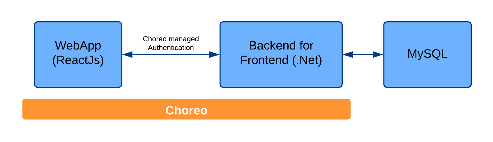

# Demo Bank: Example Online banking portal

In this tutorial, we’ll walk through building and deploying a full-stack sample application on WSO2 Choreo. The application includes a backend service written in Go lang, a ReactJS frontend, and a MySQL database. This tutorial demonstrates how Choreo supports both developers and platform engineers by enabling secure deployments, managed APIs, and built-in observability. By the end, you'll have a working application running on Choreo and a clear understanding of how its platform capabilities accelerate delivery and improve operational visibility.

## Prerequisites

Before you start, make sure you have:

1. **GitHub Account**
   - Ensure you have a GitHub account. Sign up or log in here: [GitHub](https://github.com/)
2. **Microsoft Visual Studio Code**
   - Download and install Visual Studio Code if not already installed: [VSCode](https://code.visualstudio.com/)
3. **Git**
   - Install Git for version control. Follow the installation guide here: [Git](https://git-scm.com/downloads)
4. **Web Browser**
   - A recent version of Google Chrome or Mozilla Firefox is required.
5. **Choreo Account**
    - Sign up for a Choreo account to integrate and deploy services efficiently.

## Architecture

This application has two main components: a ReactJS frontend and a Go-based backend. The frontend communicates with the backend via REST APIs, while the backend connects to a MySQL database for data persistence. To secure the application, it uses Choreo-managed authentication, ensuring controlled access to protected resources across the stack.

### Project Setup Guidance 
[Set up guidance](user-guide.pdf)
